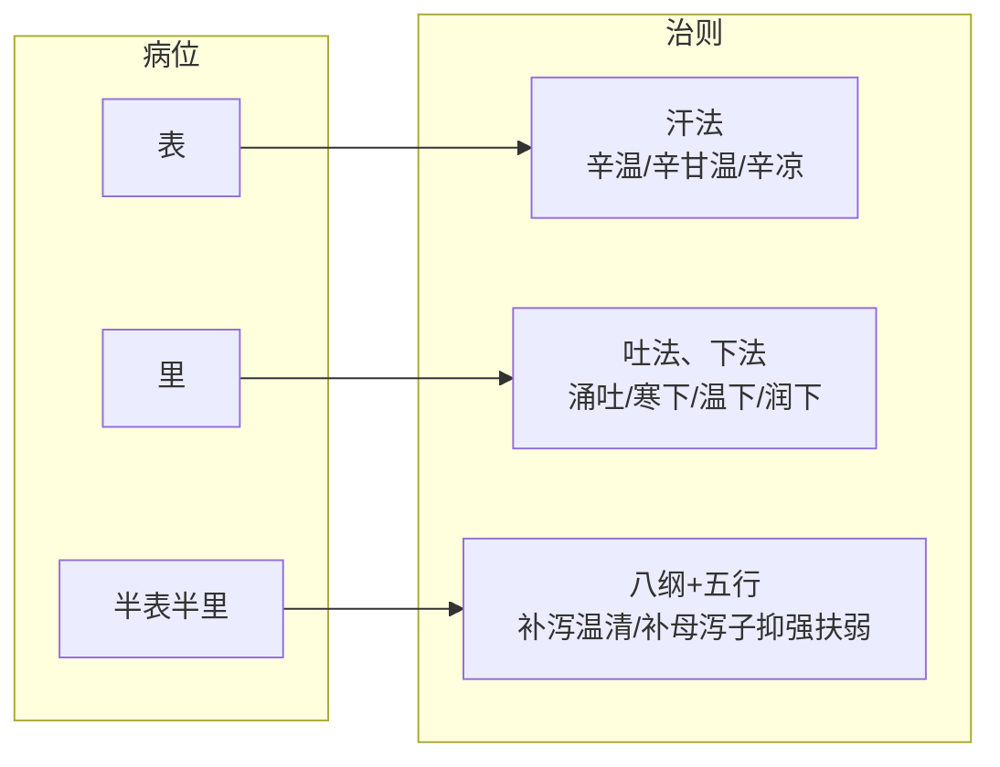

# 中医治则对称模型：三病位-治法公理化框架

**一个基于病位-治法对称性的辨证决策路径体系**

---

## 摘要

中医治则理论长期存在逻辑含混：传统"里"证概念过度宽泛导致治则不统一，半表半里几乎被等同于少阳和法、无法对接脏腑复杂病证，五种辨证方法并列呈现却无调用顺序。本文提出一个高度对称的病位-治法公理化框架：**表证（体表）→汗法；里证（消化道管腔有形实邪）→吐法、下法；半表半里（五脏六腑、胸腹腔、气血津液）→八纲定方向、脏腑定靶点、五行定路径（温清消补可复合为和法）**。在此核心基础上，为八纲、脏腑、六经、三焦、气血津液五种辨证方法建立统一的调用次序——从并列关系转化为递进关系，使学习者面对复杂病证时有清晰的决策路径。框架通过与胡希恕体系的关系辨析、六例典型病案验证和多个关键问题的澄清讨论，展现了理论的自洽性、教学价值和当前边界。本文认为，理论框架的有效性在于内部逻辑自洽与解释的完备性，而非对经典条文的逐一对位。

**关键词**：治则；对称性；八法；半表半里；五行生克；公理化模型

---

## 目录

1. [引言：问题与动机](#1-引言问题与动机)
2. [模型的边界与定位](#2-模型的边界与定位)
3. [理论基础：基本物质与虚实结构](#3-理论基础基本物质与虚实结构)
4. [三个基本病位](#4-三个基本病位)
5. [病位-治法对称性](#5-病位-治法对称性)
6. [五步辨证决策路径](#6-五步辨证决策路径)
7. [与胡希恕体系的关系](#7-与胡希恕体系的关系)
8. [关键问题的澄清与讨论](#8-关键问题的澄清与讨论)
9. [临床病案验证](#9-临床病案验证)
10. [模型的边界与局限](#10-模型的边界与局限)
11. [结语](#11-结语)

---

## 1 引言：问题与动机

### 1.1 困境：中医辨证为什么难学？

中医辨证难的症结不在于知识总量过大，而在于**缺乏操作路径**。

学生在课程中修习了八纲辨证、脏腑辨证、六经辨证、三焦辨证、气血津液辨证共五种辨证方法之后，面对临床情景时无从下手——不是不知道五种方法各自什么内容，而是不知道第一步该用哪一个、第二步该用哪一个。五种方法被呈现为平行的选项，但没有给出选择的规则和顺序。这种"平行而不递进"的结构，让学习者在理论阶段和临床阶段之间出现了一条巨大的断层。

### 1.2 更根本的逻辑困境：概念含混

在五种辨证方法的表面困境之下，是一个更根本的逻辑问题——核心概念的边界模糊。

传统"里证"几乎变成了一个万能容器：阳明腑实（燥屎内结）是里，阳明经证（白虎汤）是里，太阴病（脾虚寒）是里，少阴病（心肾阳虚）是里，甚至厥阴病（寒热错杂）有时也被笼统地归为里。概念的外延过大直接导致其信息量降低——一个能解释一切的概念，实际上丧失了解释力。同叫"里证"，下法、清法、温法、补法都可以对应用上，治则因此失去与病位的固定映射关系。

半表半里同样存在分类困境。它几乎被等同于少阳病和和法，治法范围被人为收窄。五脏六腑的虚实寒热、气血痰食的复杂病证，在传统分类中没有清晰的归属路径——它们既不是表也不是里，但传统的"半表半里"框架又不足以支撑它们的分析。

### 1.3 本模型的核心思路

本模型的核心思路非常朴素：**为已有的辨证方法建立一个确定的调用顺序。**

具体而言，就是将人体疾病按三个互斥病位（表、里、半表半里）分类，为每个病位赋予对应的治法方向，然后按固定的五步决策路径依次走完。不发明新的辨证方法，只改变已有方法的组织方式和使用顺序。

---

## 2 模型的边界与定位

### 2.1 解决问题与不解决的问题

中医临床决策链可以切为两段：**症状→治法治则**与**治法治则→具体方药**。

- **本模型解决前者**：从症状到治法治则之间的路径问题，让辨证分析更加合理、准确、公式化，没有模糊空间。
- **本模型不解决后者**：从治法治则到具体方药的决策，取决于医者对药性的理解准确性和临床经验的积累，是任何理论框架无法取代的。

这一边界不是缺陷，而是模型的自知之明。一个理论框架的价值不在于它覆盖了多少范畴，而在于它在自己承诺覆盖的范畴内是否做到自洽、清晰、无歧义。

### 2.2 模型的性质定位

本模型是一个**形式化的辨证决策框架**，而非临床操作指南。

类比而言：模型提供的是"地图"，呈现了病位、治则和决策路径的整体结构。地图的价值在于帮助使用者建立空间认知、理解各部分之间的逻辑关系。但地图本身不标注每条路的具体走法、所需时间、路况细节——这些属于传统方证学习的内容。

- ✅ 模型提供结构化的认知框架
- ✅ 模型为各种辨证方法分派了明确的角色和调用顺序
- ❌ 模型不替代具体方剂、药量、配伍的学习
- ❌ 模型不替代四诊信息采集技能的掌握

### 2.3 公理体系与解题人经验

本模型的性质可以类比数学中的公理与定理体系。公理解决的是元问题——最基本、最单纯的问题。临床中遇到的复杂病证（如表里同病、寒热错杂、多脏腑受累），不是对公理体系的否定，而是多个元问题的复合。正如复杂数学题需要综合运用多个公理和定理分步骤解题，复杂病证也需要通过本模型的元规则进行分层拆解。数学公理不因问题复杂而失效，恰恰相反——复杂问题需要通过公理体系才能被有序地分解和解决。

一个复杂问题如何一步步分解成元问题、每个元问题按什么优先级处理——这取决于解题人的经验和水平，公理本身不提供答案。本模型同样如此：它提供了一套元规则，但复杂临床情境下的拆解和优先级判断，需要使用者通过学习和积累来掌握。这恰恰是所有公理体系的常态，不是缺陷。

---

## 3 理论基础：基本物质与虚实结构

### 3.1 气、血、津、液

气、血、津、液是构成人体和维持人体生命活动的最基本物质：

- **气**：活力很强、无形可见的精微物质，属阳。
- **血**：富有营养的红色液体，属阴。
- **津、液**：体内一切正常水液的总称，属阴。津清稀，液稠厚。

### 3.2 虚证的层次结构

虚证的本质是人体正气不足。根据所虚物质的不同，可分为四个层次：

| 证型 | 核心公式 | 物质基础 | 临床表现 |
| :--- | :--- | :--- | :--- |
| **气虚** | 气亏虚 | 气（整体） | 乏力、气短、自汗（无寒热） |
| **阴液亏虚** | 血、津、液亏虚 | 血、津、液 | 口干、皮肤干、便干（无热象） |
| **阳虚证** | 气虚 + 寒象 | 气中之阳不足 | 气虚 + 畏寒肢冷 |
| **阴虚证** | 阴液亏虚 + 热象 | 血、津、液不足 | 干燥 + 五心烦热、盗汗 |

**气虚不等于阳虚。** 单纯气短乏力但不畏寒者，是气虚而非阳虚。这一区分直接影响用药方向（补气 vs 温阳）。

**临界点处理：** 气虚到阳虚是疾病缓慢发展的连续过程。在临界点上（即寒象初现但尚不明确的阶段），按气虚为主、稍微兼顾阳虚处理即可。不需要在临界点上做出一个非此即彼的硬性分类——这符合临床实际，也是框架对连续性的自然处理方式。

### 3.3 实证的分类

实证的本质是邪气亢盛。分为两类：

| 证型 | 核心公式 | 邪气来源 |
| :--- | :--- | :--- |
| **阳盛** | 阳邪亢盛 + 热象 | 气盛（功能亢进）或外感热邪 |
| **阴盛** | 阴邪亢盛 + 寒象 | 多余的阴液（痰饮、水湿、瘀血）或外感寒邪 |

实证的分类相对简单——不存在"血盛""津液盛"等独立概念。外感病初起均为实证（阳盛或阴盛），除非后期邪去正虚才出现虚证。

---

## 4 三个基本病位

### 4.1 三病位定义

将人体划分为三个互斥的基本病位：

| 病位 | 范围 | 举例 |
| :--- | :--- | :--- |
| **表** | 皮肤、肌肉、筋骨、腠理 | 感冒初起、身痛、无汗 |
| **里** | 消化道管腔（口→食管→胃→小肠→大肠→肛门） | 胃有宿食、肠有燥屎 |
| **半表半里** | 五脏六腑、胸腹腔、气血津液 | 咳嗽、胃痛、肝郁、肾虚、一切内伤杂病 |

### 4.2 结构的几何表达

```text
    ┌─────────────┐
    │     表      │  ← 皮肤、肌肉、筋骨
    │  ┌───────┐  │
    │  │ 半表半里│  │  ← 五脏六腑、胸腹腔、气血津液
    │  │ ┌───┐ │  │
    │  │ │ 里 │ │  │  ← 消化道管腔
    │  │ └───┘ │  │
    │  └───────┘  │
    └─────────────┘
```

### 4.3 互斥的准确含义

三病位互斥，指的是**分类维度的互斥**，而非"患者状态"的互斥。一个患者在同一时间可以同时存在表证和半表半里证（例如感冒同时有老胃病），在分析层面各自归入对应的病位，不冲突。但就"这一个具体的病理问题"而言（比如"恶寒发热"本身是表证，而"胃脘隐痛"本身是半表半里证），每一个具体的症状群有且只有一个病位归属。

这一澄清至关重要：**互斥发生在分类坐标中，而非发生在患者身上。**

### 4.4 半表半里不是剩集

表是具体的（皮肤肌肉筋骨），里是具体的（消化道管腔），半表半里是**表与里之间的整个空间**——它同样是一个有明确边界的区域，而非"不是A也不是B的剩余物"。就像指定了北京的八环和六环，那"六环到八环之间"就是一个有明确边界的环域，不是剩集。半表半里包含了五脏六腑、胸腹腔、气血津液——这些位置在人体中清晰可辨，有具体的解剖学（和功能学）内涵。

### 4.5 传统"里"概念的重新切割

传统"里证"包含了三种截然不同的病证：消化道有形实邪（燥屎）、无形热邪（白虎汤证）、脏腑虚寒（四逆汤证）。本模型将"里"严格限定为第一种——**消化道管腔的有形实邪**（燥屎、宿食、痰涎、虫积等）。后两种被明确的重新归类：

| 传统归类 | 本模型归类 | 理由 |
| :--- | :--- | :--- |
| 阳明腑证（大承气汤） | **里** | 燥屎在肠道，消化道管腔有形实邪 |
| 阳明经证（白虎汤） | **半表半里** | 无形气热，不在管腔 |
| 太阴病（理中丸） | **半表半里** | 脾脏虚寒，属脏腑层面 |
| 少阴病（四逆汤） | **半表半里** | 心肾阳虚，属脏腑层面 |

这一修正的价值："里"恢复了信息量——不再是可以随意填充的容器，而是有明确边界、可与"表"和"半表半里"形成互斥关系的分析工具。

---

## 5 病位-治法对称性

### 5.1 核心映射——三病位对应三治法

| 病位 | 核心治法 | 说明 |
| :--- | :--- | :--- |
| **表** | **汗法** | 唯一出路，邪在表当汗解 |
| **里** | **吐法、下法** | 唯一出路，清除消化道管腔有形实邪 |
| **半表半里** | **八纲+五行**（温清消补可复合为和法） | 不设单一固定治法，根据病性选用补泻温清，在脏腑层面融入五行生克 |

### 5.2 表证：汗法与内部分型

| 表证类型 | 病性 | 治则 | 代表方 | 关键鉴别点 |
| :--- | :--- | :--- | :--- | :--- |
| 表实寒（太阳伤寒） | 实寒 | 辛温发汗 | 麻黄汤 | 无汗、恶寒、身痛、脉浮紧 |
| 表虚寒（太阳中风） | 虚寒 | 辛甘温解肌 | 桂枝汤 | 有汗、恶风、脉浮缓 |
| 表热（太阳温病） | 热 | 辛凉透表 | 银翘散 | 发热、微恶寒、咽痛、脉浮数 |

### 5.3 里证：吐下法与内部分型

| 里证类型 | 病性 | 治则 | 代表方 |
| :--- | :--- | :--- | :--- |
| 宿食痰涎停胃 | 实 | 涌吐 | 瓜蒂散 |
| 燥屎热结 | 实热 | 寒下 | 大承气汤 |
| 寒积便秘 | 实寒 | 温下 | 温脾汤 |
| 津亏便秘 | 津虚+实 | 润下 | 麻子仁丸 |

**对称性说明**：表证的辛温/辛甘温/辛凉是汗法的内部分型，里证的寒下/温下/润下是下法的内部分型——二者在结构上完全对称。吐法在上消化道（胃脘），下法在下消化道（肠），两者在"清除消化道管腔有形实邪"的功能上统一。

### 5.4 半表半里：综合治则

本模型在半表半里不设单一固定治法，而是采用了三层递进的分析结构：

| 层次 | 操作 | 要解决的问题 |
| :--- | :--- | :--- |
| **第一层：八纲定方向** | 判断虚实寒热 | 补/泻/温/清？ |
| **第二层：脏腑定靶点** | 判断病变脏腑 | 心/肝/脾/肺/肾？ |
| **第三层：五行定路径** | 设计调控策略 | 补母/泻子/抑强扶弱？ |

其中，"温清消补"恰好对应治则总纲的四种基本情形：

| 治则总纲 | 治法 | 代表方 |
| :--- | :--- | :--- |
| 虚则补之 | 补法 | 四君子汤 |
| 实则泻之 | 消法 | 二陈汤 |
| 寒者热之 | 温法 | 四逆汤、理中丸 |
| 热者寒之 | 清法 | 白虎汤、黄连解毒汤 |
| 温清消补复合 | 和法（复合治则） | 小柴胡汤、半夏泻心汤 |
| 五行生克乘侮 | 补母/泻子/抑强扶弱 | 逍遥散、导赤散、一贯煎 |

半表半里的治法选择由此与整体治则形成严格的对称对应，无需额外增加规则。

五行调控的三种基本模式：

| 模式 | 含义 | 临床案例 |
| :--- | :--- | :--- |
| **虚则补其母** | 子虚时补母以固本 | 肺气虚→补脾（培土生金）→四君子汤 |
| **实则泻其子** | 母实时泻子以疏路 | 肝火旺→泻心火→导赤散 |
| **抑强扶弱** | 乘侮背离时双方同调 | 肝气犯脾→疏肝健脾（抑木扶土）→逍遥散 |

### 5.5 图形化表达



---

## 6 五步辨证决策路径

### 6.1 路径总览

面对一个病证，按以下五步依次进行：

```text
① 定病位 ────→ ② 定方向 ────→ ③ 定靶点 ────→ ④ 定路径 ────→ ⑤ 补充
  三病位         八纲           脏腑           五行           六经/三焦
                                                                /气血津液
```

每一步缩小一圈问题空间，五步走完，从模糊主诉收敛到精确治则。

### 6.2 各步骤详表

| 步骤 | 辨证方法 | 问题 | 输入 | 输出 |
| :--- | :--- | :--- | :--- | :--- |
| **1** | 三病位定位 | 病在何处？ | 症状集合 | 表/里/半表半里 |
| **2** | 八纲辨证 | 虚实寒热方向？ | 病位+症状 | 补/泻/温/清 |
| **3** | 脏腑辨证 | 病在何脏何腑？ | 病位+方向+症状 | 心肝脾肺肾… |
| **4** | 五行生克乘侮 | 如何调控？ | 病位+方向+脏腑 | 补母/泻子/抑强扶弱 |
| **5** | 六经/三焦/气血津液 | 补充细化？ | 以上所有 | 精确化信息 |

### 6.3 各辨证方法的角色定位

| 辨证方法 | 在路径中的功能 | 调用时机 |
| :--- | :--- | :--- |
| **三病位定位** | 划定分析范围 | **第一步（必经）** |
| **八纲辨证** | 确定治疗方向 | **第二步（必经）** |
| **脏腑辨证** | 定位靶器官 | **第三步（必经）** |
| **五行生克** | 设计调控策略 | **第四步（必经）** |
| **六经辨证** | 提示传变路径与病势阶段 | 第五步（补充） |
| **三焦辨证** | 划分空间层次（上中下） | 第五步（补充） |
| **气血津液辨证** | 确定病变物质层面（气/血/津/液） | 第五步（补充） |

### 6.4 从并列到递进

传统辨证体系的根本问题不是"谁对谁错"，而是**没有层次**。五种辨证方法被放在同一层级，哪种适合用哪种——这对初学者是灾难，对老中医也是经验重于逻辑。

本模型的根本贡献不在于发明了新的辨证方法，而在于**为已有的辨证方法建立了调用优先级和组织架构**。五个步骤的决策路径让辨证从"艺术"走向了"程序化"——不是取代老中医的经验，而是让学习者有一条清晰可循的路。

这种有序组织的实现有一个关键的逻辑前提：**先做了减法**。表、里被严格切割之后，半表半里不再是一个被动接收边缘案例的接盘侠，而是变成了一个有内部结构的正空间。在这个空间里，每种辨证方法有了自己专属的工作面——八纲不必在同一个"里"概念下同时处理下法、清法、温法；脏腑回到了自己的天然主场；五行生克直接落在脏腑靶点上。模糊空间的消失，不是因为每个工具更锋利了，而是因为每个工具终于找到了自己的位置。

### 6.5 说明

- 若第一步判定为"表"或"里"，则直接走对应的专属治法（汗法或吐下法），后四步作为补充细化（例如表证细分辛温/辛甘温/辛凉）。**五步路径主要针对半表半里的复杂分析。**
- 若第一步判定为"半表半里"，则必须依次走完八纲→脏腑→五行三个层次，不得跳过。
- 第五步为可选补充层，根据情况选择适用。

---

## 7 与胡希恕体系的关系

### 7.1 胡希恕的贡献

胡希恕先生提出"六经来自八纲"，将六经还原为表、里、半表半里三个病位与阳证、阴证两个病性的组合，为本模型提供了重要基础。本模型的核心框架——按三病位分类的思路——直接源于胡希恕先生的学术思想。

### 7.2 本模型的差异和改进

| 对比维度 | 胡希恕体系 | 本模型 |
| :--- | :--- | :--- |
| **"里"的定义** | 包含下法与清法 | 严格限定为消化道管腔有形实邪，无形热邪归半表半里 |
| **半表半里治则** | 主要对应和法 | 八纲+五行的综合框架，和法是温清消补在寒热虚实夹杂时的复合运用 |
| **辨证方法关系** | 未明确建立调用顺序 | 五种辨证方法转化为递进关系，各司其职 |
| **公理化程度** | 未明确追求形式化 | 以公理化为目标，概念边界严格，消除例外 |

### 7.3 对传人发展的评价

胡希恕传人（如冯世纶）将"方证相应"独立为第三维度，增强了临床操作性，但从追求理论简洁和形式美的角度看，这是一种远离公理化方向的发展。本模型认为，理论框架的改进方向应当是减少规则的模糊性——不是增加规则的条目数——以维持其内部自洽性和教学友好性。

---

## 8 关键问题的澄清与讨论

### 8.1 定性即公式化

本模型的一个核心认识是：**定性本身就是公式化。** 并非只有定量才是公式——方向性的二元判断（"有/无""表/里""实/虚""急/缓"）同样是可复现的公式化操作。

**举例：** 两人同时喊痛，无法绝对量化谁更痛。但在本框架中，不需要这个数字。需要回答的是：这是寒痛还是热痛？虚痛还是实痛？疼痛是表证还是半表半里证？方向定对了，疗效就有保证。定性（定方向）是临床决策中最关键的一步——它决定了治疗是否有效、是否会让病情加重。方向正确时，刻度只是锦上添花。

框架中出现的"里虚明显""表急深重"等表述，不是模糊的经验描述，而是在定性判断中已占据主导地位的方向性结论。程度判定基于可复现的逻辑定向，而非依赖刻度尺。这一定位决定了框架的性质：它是**定向层面上的形式化**，而非定量层面上的形式化。方向定了，路径就不跑偏。

### 8.2 互斥 vs 并存

本模型在这一对话中明确了一个关键区分：**三病位互斥是分类维度的互斥，而非患者状态的互斥。**

一个患者可以同时有表证（外感风寒）和半表半里证（脾虚湿盛），这在分类层面没有矛盾——两个不同的病理问题各自归入对应的病位，互斥的分类坐标不因"同一个人"而被打破。

当多个病位的问题同时出现时，处理优先级取决于问题的轻重缓急：
- **急者先治，重者先治**——这是所有医学通行的原则，不是框架特有的
- **表里同病**：一般先表后里（表邪未解先治里可能导致邪气内陷），但里虚较重时可表里同治（如麻黄附子细辛汤）
- **虚实夹杂**：急则治标（实邪急迫先泻实），缓则治本（虚证为主先补虚），亦可攻补兼施（如黄龙汤）

具体优先级的判断需要临床经验的积累。框架不替使用者做这个判断——框架提供元问题的处理规则，复杂问题的分解策略依赖使用者的经验水平。这恰恰是所有公理体系的常态。

### 8.3 框架与传变（时间维度）

本框架目前主要进行的是**现状分析**——给当前症状群定位、定性、定靶点、定路径。它尚未内建"以当前状态预测疾病走向"的功能模块。

但这不意味着框架不能处理传变。六经辨证在本框架中被定位为"第五步补充层"——它可以提供传变路径的视角。同时，六经的传变规律可以被视为"三病位 + 病性 + 时间"的动态描述，与框架的三病位基础在结构上是同构的。因此框架在理论上可以自然延伸出时间维度的分析能力：只要将传变路径（如太阳→少阳→阳明→太阴）的规律整理出来，作为补充层面的经验规则，框架就拥有了动态视角。

框架目前未内建预测能力——这是框架当前阶段的一个未涉足的领域，而非缺陷。

### 8.4 "表"的定位问题（当前未完全解决的遗留问题）

本模型目前将"表"定义为：体表（皮肤、肌肉、筋骨）。但在临床运用中，一个核心问题仍待澄清：

**"表"本质上是一个位置概念（体表发生的任何病），还是一个机制概念（正邪交争于体表的外感初起状态）？**

如果是前者：外伤、冻伤、皮肤病发生在体表，理论上应该走"表→汗法"路径——但在实践中，这些病证的治法与汗法无关。
如果是后者：则"表"实质上是"表证"，包含了外感病初起的特定病机——但这与三病位的"位置"定义形成了张力。

一个可能的处理方式是：将"表"理解为**位置**（皮肤肌肉筋骨），确认在此位置上发生的病证并不一定都是"表证"（即需要汗法治疗的病证）。"表证"是"表位 + 外感病机"的复合。体表的非外感病（瘀血、外伤等）按病机实质上归入半表半里（气血津液层面）来处理。

这一问题的最终确认，有待框架在临床运用中进一步检验和校准。本文在此将其标记为**未完全解决但可自然收口**的开放问题——它不影响框架的核心自洽性，但需要在后续发展中明确表述。

### 8.5 五行层的深度与框架的自然边界

本框架前三层（病位→八纲→脏腑）的形式化程度很高，每一步有确定的输入和输出。但越往深处走，框架的指导密度越薄：

- **八纲层**：判断虚实寒热的有无——清晰，边界明确
- **脏腑层**：判断病在哪个脏腑——清晰，但需要脏腑辨证的基础知识
- **五行层**：设计补母/泻子/抑强扶弱的策略——本层目前只给出了几个经典公式（培土生金、泻心火、抑木扶土），尚未建立"在每个脏腑的不同病性下，五行调控的优先级和限制条件"的完整体系

这不是框架的缺陷，而是框架形式化的自然边界。五行生克乘侮是中医中最灵活也最复杂的调控工具，其完全形式化本身就是不可能的任务。框架在五行层保持了适度的开放性——提供基本公式，允许使用者以自身经验填充细节。

---

## 9 临床病案验证

本节通过典型病案演示本模型五步决策路径的临床运行。每个案例按照模型决策步骤展开。

### 9.1 案例A：表实寒证（麻黄汤）

**症状**：淋雨后恶寒发热、无汗、头身疼痛、骨节酸楚、舌淡苔白、脉浮紧。

| 步骤 | 辨证 | 输出 |
| :--- | :--- | :--- |
| 1. 定病位 | 恶寒发热、无汗、身痛、脉浮 | 表 |
| 2. 定治法 | 表→汗法 | 汗法 |
| 3. 定细则 | 恶寒重、无汗、脉浮紧→表实寒 | 辛温发汗 |
| 4. 选方 | 麻黄汤 | ✅ |

### 9.2 案例B：里实热证（大承气汤）

**症状**：多日不大便、腹满硬痛、潮热谵语、手足汗出、舌苔黄燥、脉沉实。

| 步骤 | 辨证 | 输出 |
| :--- | :--- | :--- |
| 1. 定病位 | 大便燥结在肠道→有形实邪 | 里 |
| 2. 定治法 | 里→下法 | 下法 |
| 3. 定细则 | 热盛津伤+燥屎内结 | 寒下 |
| 4. 选方 | 大承气汤 | ✅ |

### 9.3 案例C：少阳证（小柴胡汤）

**症状**：往来寒热、胸胁苦满、心烦喜呕、默默不欲饮食、口苦咽干、脉弦。

| 步骤 | 辨证 | 输出 |
| :--- | :--- | :--- |
| 1. 定病位 | 不在表（不恶寒发热并见），不在里（无有形实邪） | 半表半里 |
| 2. 八纲定方向 | 寒热往来+实证倾向→枢机不利 | 和法（复合） |
| 3. 脏腑定靶点 | 胆+三焦 | 少阳 |
| 4. 五行定路径 | 胆属木，木郁疏之 | 疏解少阳 |
| 5. 六经补充 | 少阳病 | 和解少阳 |
| 6. 选方 | 小柴胡汤 | ✅ |

### 9.4 案例D：阳明经证（白虎汤）

**症状**：大热、大汗、大渴、脉洪大。

| 步骤 | 辨证 | 输出 |
| :--- | :--- | :--- |
| 1. 定病位 | 不在表；无燥屎宿食→不在里 | 半表半里 |
| 2. 八纲定方向 | 大热、脉洪→阳盛 | 热者寒之 |
| 3. 脏腑定靶点 | 胃经热盛（管腔无形→气分） | 阳明气分 |
| 4. 五行定路径 | 胃属土，热盛 | 大清气热 |
| 5. 六经补充 | 阳明经证 | 清法 |
| 6. 选方 | 白虎汤 | ✅ |

**说明**：白虎汤证在传统框架中归"里热"，在本模型中因无形邪气不在消化道管腔而归入半表半里——这是模型用定义严格性倒逼概念归类的体现。

### 9.5 案例E：上热下寒（半夏泻心汤）

**症状**：胃脘灼热、口臭、大便溏薄、腹冷痛、手足不温、舌红苔黄根部白腻。

| 步骤 | 辨证 | 输出 |
| :--- | :--- | :--- |
| 1. 定病位 | 不在表；消化道症状非有形实邪 | 半表半里 |
| 2. 八纲定方向 | 上热下寒→寒热并见 | 温清并用 |
| 3. 脏腑定靶点 | 胃热+脾寒 | 胃+脾 |
| 4. 五行定路径 | 脾寒→温中；胃热→清胃 | 辛开苦降 |
| 5. 选方 | 半夏泻心汤 | ✅ |

### 9.6 案例F：少阴虚寒（四逆汤）

**症状**：脉微细、但欲寐、四肢厥冷、下利清谷。

| 步骤 | 辨证 | 输出 |
| :--- | :--- | :--- |
| 1. 定病位 | 不在表；下利清谷为消化功能虚寒非有形实邪 | 半表半里 |
| 2. 八纲定方向 | 虚寒 | 寒者热之+虚则补之 |
| 3. 脏腑定靶点 | 心肾阳虚 | 少阴 |
| 4. 五行定路径 | 心火不暖土→脾土失温 | 回阳救逆 |
| 5. 选方 | 四逆汤 | ✅ |

**说明**：下利清谷虽是消化道症状，但其本质是脏腑虚寒导致的功能障碍，而非消化道管腔的有形实邪——这是模型"里"定义严格性的体现。

---

## 10 模型的边界与局限

### 10.1 完全适用的区间

三病位全面覆盖——外感表证（汗法，依病性分辛温/辛甘温/辛凉）、里证（吐下法）、半表半里（八纲+五行）。外感表证与内伤杂病均在统一框架下，无例外。

### 10.2 不覆盖的区间

- **方剂配伍与药量**：模型止步于辨证与治则方向的确立
- **四诊信息采集**：不涉及望闻问切的技巧
- **急症抢救和非药物疗法**：如外伤清创、针灸特定操作等

### 10.3 框架当前的存在状态

本框架在**逻辑自洽性**上已达到较高水平。核心映射关系清晰，五步决策路径明确，关键概念边界严格，经六例病案验证均走通。在"症状→治法治则"这一范围内，框架没有发现致命的逻辑漏洞。

以下是框架当前尚未完全解决的问题和未来发展方向：

- **"表"的位-证张力**：第8.4节已陈述，有待在临床运用中最终校准表述
- **预测功能未内建**：目前为回溯性分析，有向动态预测延伸的空间
- **五行层的形式化深度不足**：越深越薄，是框架形式化的自然边界，但可从经验积累中逐步充实
- **程度判定的教学工具未开发**：框架在"里虚何等程度"的判断上交给使用者经验，这合理但教学价值打了折扣

### 10.4 框架的根本特征

1. **对称性**：三病位、三治法对称呼应；表证与里证的内部分型在结构上对称。对称性不是装饰，是逻辑自洽的外在表征。
2. **算法化**：辨证过程可复现。每一步有确定的输入输出，降低学习门槛。辨证从依赖个人悟性的"技艺"转变为步骤明确的"程序"。
3. **边界清晰**：每个核心概念有严格定义，三病位互斥使用，恢复概念的分辨力。
4. **辨证方法协同**：五种辨证方法从平行竞争转为递进协作。
5. **开放性**：传统方证、各家学说、前人经验均可作为补充维度接入，非封闭体系。
6. **无例外**：三病位定义互斥且完备。对任一病证依次回答三个问题（在表？在里？其他？）必得唯一归属。不存在两个病位同时命中或全部落空的情况。这不是经验的巧合，而是分类结构本身的必然结果。因定义严格而无需例外条款——这种普遍性不是通过增加规则实现的，而是通过减少概念的模糊性实现的。

---

## 11 结语

本文从中医治则理论的逻辑困境出发，明确定义了框架的边界——覆盖"症状→治法治则"段，不覆盖"治法治则→方药"段。从气、血、津、液的基本物质出发，梳理了虚证、实证的层次结构。在此基础上，构建了一个高度对称的病位-治法模型：**表证→汗法；里证（消化道有形实邪）→吐下法；半表半里（脏腑、胸腹腔、气血津液）→八纲定方向、脏腑定靶点、五行定路径**。这一框架没有发明新的辨证方法，而是为五种已有辨证方法建立了确定的调用顺序。

框架与其说是一套"新理论"，不如说是一个**教学辅助工具**。它解决的是中医初学者"五种辨证方法并列、不知从何入手"的核心痛点——把"应该先用哪个、再用哪个"说清楚了。它不是要替代传统辨证，而是要让它更容易被理解和传递。框架在逻辑上是自洽的，在临床案例中是走得通的，在教学意义上是明确的。

但框架也有它自己的边界。越往深处走（五行层），形式化的密度越低；时间维度的预测能力尚未内建；某些概念（如"表"究竟是位置还是证型）仍需进一步校准。这些都不是致命问题，它们是框架下一步可以发展的方向。

更重要的是：一个理论框架的价值不在于它是完美的，而在于它是一个**可以被讨论、被批评、被迭代的开端**。框架摆在这里，它允许你不同意它、修改它、扩展它、或者干脆推翻它另建一个更好的。因为它不是对经典的挑战，只是一个教具——帮助学习者在迷雾中找到一条路。

---

*本文档以CC BY 4.0许可证发布，可自由使用、修改、传播，注明出处即可。*
