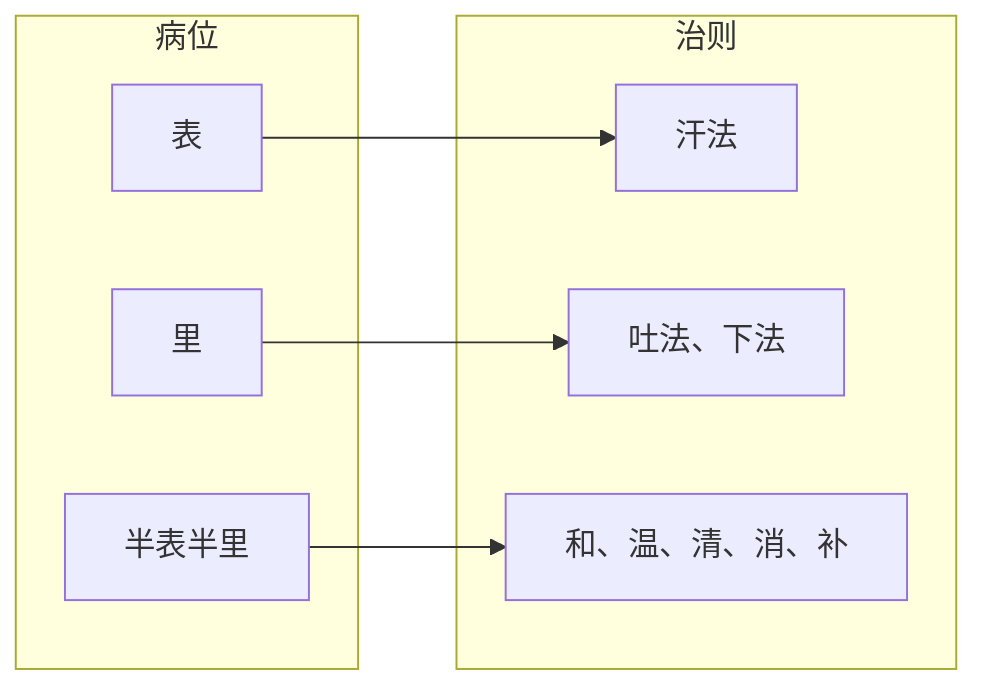

# 中医治则理论的逻辑重构：一个基于病位-治法对称性的公理化模型

## 摘要

中医治则理论长期存在逻辑含混，主要表现为“里”证概念过度宽泛，导致治则不统一，以及半表半里治则与脏腑复杂病证未能有效对接。本文从人体基本生命物质（气、血、津、液）出发，系统梳理虚证、实证、寒证、热证的内在结构，提出气虚/阴液亏虚为阳虚/阴虚的“初级阶段”。在此基础上，构建了一个高度对称的病位-治法模型：**表证治则以汗法为唯一出路；里证（严格限定为消化道有形实邪）治则以吐法、下法为唯一出路；半表半里（脏腑、胸腹腔、气血津液）不设固定单一治法，而是整体遵循“虚则补之，实则泻之，寒者热之，热者寒之”（温清消补可复合为和法），并在脏腑层面融入五行生克乘侮关系（如补母、泻子、抑强扶弱等）**。表证是三个病位之一，治以汗法，依病性（寒/热/虚）细分为辛温、辛甘温、辛凉，与里证、半表半里同属统一框架，无特殊例外。本文认为，理论模型的有效性在于其内部逻辑自洽与解释的完备性，而非对经典条文的逐一对位。该模型为中医治则的公理化建构提供了新视角。

在此基础上，进一步阐述了本模型如何为八纲辨证、脏腑辨证、六经辨证、三焦辨证、气血津液辨证提供统一的调用次序与角色分工——将五种辨证方法从并列关系转化为递进关系，使学习者面对复杂病证时能有清晰的决策路径。模型还细化了里证治则（吐法、下法）的内部分型（涌吐、寒下、温下、润下），与表证汗法的分型形成完全对称。最后，通过六例典型病案的全程演练，验证了模型决策路径在临床中的可行性与逻辑自洽性。

本模型的根本特征在于：因定义严格，故无例外。三病位互斥、三治法各自对应，任何病证均可在框架内找到唯一归属，无需借助"特殊"或"例外"来解释。这种普遍性不是通过增加规则实现的，而是通过减少概念的模糊性实现的。

5. **不存在边缘案例的可能**——三病位定义互斥且完备：表（皮肤肌肉筋骨）、里（消化道管腔有形实邪）、半表半里（以上两者之外）。对任一病证依次回答三个问题（在表？在里？其他？），必得唯一归属。不存在两个病位同时命中或全部落空的情况。因此，边缘案例在逻辑上不可能出现——这不是经验的巧合，而是分类结构本身的必然结果。

**关键词**：治则；对称性；八法；半表半里；五行生克；公理化模型

---

## 1 引言

中医治则理论以八纲（阴阳、表里、寒热、虚实）为辨证纲领，以八法（汗、吐、下、和、温、清、消、补）为治疗方法，经过两千年临床验证，具有深刻实践价值。然而，该体系在逻辑自洽性上存在明显缺陷。历代医家与学习者常感困惑：为何同属“里证”，燥屎内结者用下法，无形大热者用清法，虚寒者用温补？为何“半表半里”几乎被等同于“和法”，而脏腑的寒热虚实、气血痰食等复杂病证却无统一的病位归属？这些矛盾并非临床事实本身不对称，而是理论分类未能彻底贯彻逻辑一致性原则。

本文从最基本概念出发，首先确立气、血、津、液作为人体基本生命物质，系统梳理虚证、实证的层次结构，进而构建一个高度对称的病位-治法模型。该模型不依附于《伤寒论》的篇章结构，而是以公理化标准重新分类，追求内部的简洁与对称。

### 1.1 模型的边界定位

在进入正文之前，有必要先明确本模型所解决的问题范畴。中医临床决策链可以切为两段：**症状→治法治则**与**治法治则→具体方药**。本模型解决的是前者——从症状到治法治则之间的路径问题，让分析辨证过程更加合理、准确、公式化，没有模糊空间。后一段（治法治则到具体方药）取决于医者对药性的理解准确性和临床经验的积累，这是任何理论体系框架无法取代的。

这一边界并非缺陷，而是模型的自知之明。一个理论框架的价值不在于它覆盖了多少范畴，而在于它在自己承诺覆盖的范畴内是否做到自洽、清晰、无歧义。

---

## 2 基本物质与虚实证的层次结构

### 2.1 气、血、津、液的定位

气、血、津、液是构成人体和维持人体生命活动的最基本物质。其中：
- **气**：活力很强、无形可见的精微物质，属阳。
- **血**：富有营养的红色液体，属阴。
- **津、液**：体内一切正常水液的总称，属阴。津清稀，液稠厚。

### 2.2 虚证的内在结构

虚证的本质是人体正气不足。根据所虚物质的差异，可分为：

| 证型 | 核心公式 | 物质基础 | 初级阶段 |
| :--- | :--- | :--- | :--- |
| **气虚** | 气亏虚 | 气（整体） | 无寒热偏向 |
| **阴液亏虚** | 血、津、液亏虚 | 血、津、液 | 无寒热偏向 |
| **阳虚证** | 气虚 + 寒象 | 气中之阳不足 | 由气虚发展而来 |
| **阴虚证** | 阴液亏虚 + 热象 | 血、津、液不足 | 由阴液亏虚发展而来 |

**气虚与阳虚、阴虚的关系**：气虚是气血津液概念中“气”的亏虚，可表现为阳气亏虚、阴气亏虚或两者兼有。阳气亏虚指气中之阳不足，阴气亏虚指气中之阴不足。当气虚或阴液亏虚刚开始出现时，尚未产生寒象或热象，为单纯气虚或阴液亏虚；随着病情发展，气虚加重出现寒象则成阳虚，阴液亏虚加重出现热象则成阴虚。

### 2.3 实证的内在结构

实证的本质是邪气亢盛。根据邪气的性质，可分为：

| 证型 | 核心公式 | 邪气来源 |
| :--- | :--- | :--- |
| **阳盛** | 阳邪亢盛 + 热象 | 气盛（功能亢进）或外感热邪、热邪内侵 |
| **阴盛** | 阴邪亢盛 + 寒象 | 体内多余的阴液（痰饮、水湿、瘀血等）或外感寒邪、寒邪内侵 |

“盛”这一侧相对“虚”更为简单：虚证涉及气、血、津、液等多个物质层面的亏虚，而实证的阳盛、阴盛仅需判别邪气的性质（热/寒）与来源（外感/内生），不存在血盛、津液盛等独立概念。外感病初期均为实证（阳盛或阴盛），除非后期邪去正虚才出现虚证。太阳伤寒（表实寒）、太阳中风（表虚寒）均属实证。

---

## 3 治则总纲与脏腑治则

### 3.1 整体治则

人体整体层面，治则遵循最基本的四句话：
- **虚则补之**
- **实则泻之**
- **寒者热之**
- **热者寒之**

### 3.2 脏腑治则

在具体脏腑层面，治则需要融入五行生克乘侮关系，形成更精细的调控策略：
- **虚则补之**：包括补本脏腑、补母脏腑，以及兼以抑制克我者（解除压制）。
- **实则泻之**：包括泻本脏腑、泻子脏腑，以及兼以补我克者（防止传变）。
- **寒者热之**：温本脏腑、温母脏腑。
- **热者寒之**：清本脏腑、清子脏腑。

### 3.3 表证治则

三病位中，表证治以汗法，乃驱邪外出之唯一途径。依病性不同，汗法有以下分型：

| 表证类型 | 病性 | 治则 | 代表方 |
| :--- | :--- | :--- | :--- |
| 表实寒（太阳伤寒） | 实寒 | 辛温解表 | 麻黄汤 |
| 表虚寒（太阳中风） | 虚寒 | 辛甘温解肌 | 桂枝汤 |
| 表热（太阳温病） | 热 | 辛凉透表 | 银翘散 |

### 3.4 里证治则细则

三病位中，里证治以吐法、下法，乃驱逐消化道有形实邪之唯一途径。

| 里证类型 | 病性 | 治则 | 代表方 |
| :--- | :--- | :--- | :--- |
| 宿食痰涎停胃 | 实 | 涌吐 | 瓜蒂散 |
| 燥屎热结（实热） | 实热 | 寒下 | 大承气汤 |
| 寒积便秘（实寒） | 实寒 | 温下 | 温脾汤 |
| 津亏便秘（虚实夹杂） | 津虚+实 | 润下 | 麻子仁丸 |

**对称性说明**：表证的辛温/辛甘/辛凉是汗法内部分型，里证的寒下/温下/润下是下法内部分型——二者在结构上完全对称。吐法在上消化道（胃脘），下法在下消化道（肠），两者在“清除消化道管腔形实邪”的功能上统一。

---

## 4 病位-治法对称模型

### 4.1 三个基本病位

将人体划分为三个互斥的基本病位：
- **表**：体表（皮肤、肌肉、筋骨）
- **里**：消化道（口→食管→胃→小肠→大肠→肛门）
- **半表半里**：胸腹腔间及五脏六腑（涵盖所有脏腑、气血、津液）

### 4.2 病位-治则对应

本模型的核心对应关系如下：

| 病位 | 范围 | 治则 | 说明 |
| :--- | :--- | :--- | :--- |
| **表** | 体表（皮肤、肌肉、筋骨） | **汗法** | 唯一出路，邪在表当汗解 |
| **里** | 消化道（口→肛门） | **吐法、下法** | 唯一出路，清除有形实邪 |
| **半表半里** | 胸腹腔间及五脏六腑 | **整体：虚则补之，实则泻之，寒者热之，热者寒之（温清消补可复合为和法）；脏腑层面：五行生克乘侮（补母、泻子、抑强扶弱等）** | 不设固定单一治法，而是八纲与五行的综合运用。"温清消补"恰好对应治则总纲的四种基本情形——虚则补之（补法）、实则泻之（消法）、寒者热之（温法）、热者寒之（清法），由此形成严格的对称对应 |

### 4.3 图形化表达

### 4.4 本模型的关键特征

1. **表、里治法具有唯一性与排他性**：表证只用汗法，里证只用吐下法，无交叉、无例外。
2. **半表半里治法具有综合性与灵活性**：它不限于某一种具体八法，而是根据病性（虚实寒热）选用补、泻、温、清（可复合为和法），并根据脏腑关系融入五行调节（补母、泻子、抑强扶弱等）。这恰恰符合临床实际——脏腑病证本就复杂，需要多维度调控。
3. **传统“里热”证的重新归类**：无形热邪（如白虎汤证）病位不在消化道管腔，应归入半表半里，治以清法；消化道有形实邪（燥屎、宿食、虫积等）归入里，治以吐下法。由此实现“里”与“吐下”的纯粹对应。

4. **消除例外——理论具有普遍预测力**：传统理论因概念边界模糊，在临床中频繁出现例外，不得不以特设性解释来维持自洽。本模型因定义严格（三病位互斥、三治法各自对应），任何病证都能在三病位框架内找到唯一归属，不依赖特殊情况或例外条款。这种普遍性不是通过增加规则实现的，而是通过减少概念的模糊性实现的。

5. **不存在边缘案例的可能**——三病位定义互斥且完备：表（皮肤肌肉筋骨）、里（消化道管腔有形实邪）、半表半里（以上两者之外）。对任一病证依次回答三个问题（在表？在里？其他？），必得唯一归属。不存在两个病位同时命中或全部落空的情况。因此，边缘案例在逻辑上不可能出现——这不是经验的巧合，而是分类结构本身的必然结果。

### 4.5 公理体系的性质：模型解决的是元问题

本模型的性质可以类比数学中的公理与定理体系。公理解决的是元问题——即最基本、最单纯的问题。临床中遇到的复杂病证（如表里同病、寒热错杂、多脏腑受累），不是对公理体系的否定，而是多个元问题的复合。正如复杂数学题需要综合运用多个公理和定理分步骤解题，复杂病证也需要综合运用本模型的多条规则进行分层分析。公理体系不因问题复杂而失效，恰恰相反——复杂问题可以通过公理体系得到有序分解。

这一性质决定了模型的教学意义：学习者不需要

---

## 5 与胡希恕体系的关系

### 5.1 胡希恕的贡献

胡希恕先生提出“六经来自八纲”，将六经还原为表、里、半表半里三个病位与阳证、阴证两个病性的组合，为本模型提供了重要基础。

### 5.2 对称性差异

胡希恕体系将白虎汤证（清法）保留在阳明（里），导致里证治法包含下法与清法，破坏了“里-下法”的纯粹性；同时其半表半里主要对应和法，未能涵盖温清消补。本模型则将无形热邪移入半表半里，使里证仅保留吐下法；将半表半里的治则明确为“八纲+五行”的综合框架，更符合临床实际。

### 5.3 对传人发展的评价

胡希恕传人（如冯世纶）将“方证相应”独立为第三维度，虽增强了临床操作性，却使理论框架趋于繁琐。从追求对称美的角度看，这是一种“负面发扬”——偏离了原初的简洁公理化方向。

---

## 6 模型对各辨证体系的统一

本节阐述本模型如何为中医现有的多种辨证方法提供一个统一的调用框架。传统教学中，八纲辨证、脏腑辨证、六经辨证、三焦辨证、气血津液辨证被视为并列的辨证方法，学习者无从确定——初学不知先用哪个、再用哪个，临证时只能凭经验摸索。本模型通过三病位框架，给这些辨证方法赋予了明确的调用次序与角色分工。

### 6.1 统一决策路径

模型确立的辨证决策路径如下：

| 步骤 | 辨证方法 | 解决的问题 | 输出 |
| :--- | :--- | :--- | :--- |
| 1 | **三病位定位** | 病在何处？ | 表 / 里 / 半表半里 |
| 2 | **八纲辨证** | 虚实寒热方向？ | 补 / 泻 / 温 / 清 |
| 3 | **脏腑辨证** | 病在何脏何腑？ | 具体靶点（肝、脾、肾…） |
| 4 | **五行生克** | 如何调控？ | 补母、泻子、抑强扶弱 |
| 5 | **六经 / 三焦 / 气血津液** | 传变特征？空间层次？物质层面？ | 补充细化 |

这一路径的核心思想是**分层降维**：每一步把问题空间缩小一圈，每步的输出是下一步的输入。初学者只需依次走完这五个层次，即可从模糊的主诉逐步收敛到精确的治则与方药方向。

### 6.2 各辨证方法的角色定位

**八纲辨证**——定方向。
它是半表半里治则的第一层过滤。面对半表半里的病证，首辨虚实寒热，确定补泻温清的方向。无论病在何脏何腑，这一层不可跳过。

**脏腑辨证**——定靶点。
方向确定之后，再辨病在哪个具体脏腑。虚实寒热是宏观方向，脏腑是微观靶点。两个维度结合，治则从“补什么”进化为“补哪个脏腑”。

**五行生克乘侮**——定调控逻辑。
脏腑辨证只能定位，不能给出关系性策略。一个脏腑的病变必然涉及生克链上的其他脏腑。五行生克提供了三种基本调控模式：
- **虚则补其母**：子虚时补母以固本（如培土生金）
- **实则泻其子**：母实时泻子以疏路（如肝火旺泻心火）
- **抑强扶弱**：乘侮背离时同时调整克我者与我克者（如抑木扶土）

**六经辨证**——定传变框架与病势阶段。
六经提供了传变的动态视角。在模型框架下，六经的“里证”被重新拆解：阳明腑证归里（消化道有形实邪），阳明经证归半表半里（无形气热），太阴、少阴、厥阴的脏腑虚实证归半表半里。六经的价值在于提示病势的传变路径（如太阳→少阳→阳明→太阴），而非作为病位分类的依据。

**三焦辨证**——定空间层次。
三焦将半表半里进一步划分为上、中、下三个空间维度，在温病辨证中尤为适用。模型不取代三焦的层次划分，而是将其作为脏腑辨证的补充——上焦心肺、中焦脾胃、下焦肝肾。

**气血津液辨证**——定物质层面。
相同脏腑、相同病性下，病变的物质层面不同，治法和方药亦不同。如肝血瘀滞与肝气郁结，同属肝脏实证，前者消法（活血化瘀）、后者消法（理气行滞）。这一维度在确定方药时至关重要。

### 6.3 从并列到递进

传统辨证体系的根本问题不是“谁对谁错”，而是**没有层次**。五种辨证方法被放在同一层级，哪种适合用哪种——这对初学者是灾难，对老中医也是经验重于逻辑。

本模型的根本贡献不在于发明了新的辨证方法，而在于**为已有的辨证方法建立了调用优先级和组织架构**。五个步骤的决策路径让辨证从“艺术”走向了“程序化”——不是取代老中医的经验，而是让学习者有一条清晰可循的路。

这种秩序的建立有一个关键的逻辑前提：先做了减法。表、里被严格切割之后，半表半里不再是一个被动接收边缘案例的接盘侠，而是变成了一个有内部结构的正空间。在这个空间里，每种辨证方法有了自己专属的工作面。模糊空间的消失，不是因为每个工具更锋利了，而是因为每个工具终于找到了自己的位置。

---

## 7 临床病案验证

本节通过典型病案演示本模型的决策路径在临床中如何实际运行。每个案例按照模型规定的五个决策步骤展开，验证其逻辑通顺、结论合理。

### 7.1 案例A：表实寒证（麻黄汤）

**症状**：患者淋雨后恶寒发热、无汗、头身疼痛、骨节酸楚、舌淡苔白、脉浮紧。

**模型分析**：
| 步骤 | 辨证 | 输出 |
| :--- | :--- | :--- |
| 1. 定病位 | 恶寒发热、无汗、身痛、脉浮 | 表 |
| 2. 定治法 | 表→汗法 | 汗法 |
| 3. 定细则 | 恶寒重、无汗、脉浮紧→表实寒 | 辛温发汗 |
| 4. 选方 | 麻黄汤 | ✅ |

**结论**：病位清晰，治则唯一，选方准确。模型在此区间运行简洁。

### 7.2 案例B：里实热证（大承气汤）

**症状**：患者多日不大便、腹满硬痛、潮热谵语、手足濈然汗出、舌苔黄燥、脉沉实。

**模型分析**：
| 步骤 | 辨证 | 输出 |
| :--- | :--- | :--- |
| 1. 定病位 | 大便燥结在肠道→消化道管腔有形实邪 | 里 |
| 2. 定治法 | 里→下法 | 下法 |
| 3. 定细则 | 热盛津伤+燥屎内结 | 寒下 |
| 4. 选方 | 大承气汤 | ✅ |

**结论**：通过。与表证对应，里证内部同样可按病性进一步细分（寒下、温下、润下等），对称于表证的辛温/辛甘/辛凉分型。

### 7.3 案例C：半表半里少阳证（小柴胡汤）

**症状**：患者往来寒热、胸胁苦满、心烦喜呕、默默不欲饮食、口苦咽干、脉弦。

**模型分析**：
| 步骤 | 辨证 | 输出 |
| :--- | :--- | :--- |
| 1. 定病位 | 不在表（不恶寒发热并见），不在里（无消化道有形实邪） | 半表半里 |
| 2. 八纲定方向 | 寒热往来+实证倾向→枢机不利，非偏寒偏热 | 和法（温清消补复合） |
| 3. 脏腑定靶点 | 胆+三焦 | 少阳 |
| 4. 五行定路径 | 胆属木，木郁疏之 | 疏解少阳 |
| 5. 补充维度（六经） | 少阳病 | 和解少阳 |
| 6. 选方 | 小柴胡汤 | ✅ |

**结论**：八纲、脏腑、五行、六经从不同角度收敛到同一结论，各司其职，不打架。

### 7.4 案例D：半表半里热证——阳明经证（白虎汤）

**症状**：大热、大汗、大渴、脉洪大。

**模型分析**：
| 步骤 | 辨证 | 输出 |
| :--- | :--- | :--- |
| 1. 定病位 | 不在表（无表证特征）；不在消化道管腔（无燥屎宿食） | 半表半里 |
| 2. 八纲定方向 | 阳盛→大热、脉洪 | 热者寒之 |
| 3. 脏腑定靶点 | 胃经热盛（管腔无有形实邪→气分热） | 阳明气分 |
| 4. 五行定路径 | 胃属土，热盛 | 大清气热 |
| 5. 补充维度（六经） | 阳明经证 | 清法 |
| 6. 选方 | 白虎汤 | ✅ |

**结论**：白虎汤证的重新归类（传统“里热”→本模型半表半里）在临床路径上完全走通。此例充分展现了模型“用病位定义的严格性倒逼概念归类”的公理化思维特征。

### 7.5 案例E：半表半里寒热错杂——上热下寒（半夏泻心汤）

**症状**：患者胃脘灼热、口臭、大便溏薄、腹冷痛、手足不温、舌红苔薄黄根部白腻。

**模型分析**：
| 步骤 | 辨证 | 输出 |
| :--- | :--- | :--- |
| 1. 定病位 | 不在表；消化道症状但非有形实邪 | 半表半里 |
| 2. 八纲定方向 | 上热下寒→热寒并见 | 温清并用 |
| 3. 脏腑定靶点 | 胃热点在上，脾寒在下 | 胃+脾 |
| 4. 五行定路径 | 胃热泻其子（泻肺？），脾寒补其母（补心？） | 辛开苦降 |
| 5. 选方 | 半夏泻心汤 | ✅ |

**结论**：半表半里不设固定单一治法的设计在此例展现了独特价值——因为不锁定于“和法”，温清并用的复合治则天然合理。若仍在传统“半表半里→和法”的框架下，此类寒热错杂证的归类反而尴尬。

### 7.6 案例F：半表半里虚寒证——少阴病（四逆汤）

**症状**：脉微细、但欲寐、四肢厥冷、下利清谷。

**模型分析**：
| 步骤 | 辨证 | 输出 |
| :--- | :--- | :--- |
| 1. 定病位 | 不在表；下利清谷为消化吸收功能障碍而非管腔有形实邪 | 半表半里 |
| 2. 八纲定方向 | 虚寒 | 寒者热之+虚则补之 |
| 3. 脏腑定靶点 | 心肾阳虚 | 少阴 |
| 4. 五行定路径 | 心火不暖土→脾土失温 | 回阳救逆 |
| 5. 选方 | 四逆汤 | ✅ |

**结论**：下利清谷虽是消化道症状，但其本质是脏腑虚寒导致的功能障碍，而非消化道管腔的形实邪——这是模型“里”定义的严格性体现。模型在此区分了“消化道管腔的形实邪（里）”与“消化功能的虚寒（半表半里）”，分类清晰。

### 7.7 病案验证总结

以上六例全面覆盖了模型的三个病位（表、里、半表半里）、三种病性（寒、热、寒热错杂）和多种复合情况。所有案例均沿模型决策路径走通，得出合理的选方结论，未出现逻辑矛盾。

模型在实践中展现了以下优势：
1. **层次清晰的决策路径**：每一步给出明确的输入和输出，降低辨证的随意性。
2. **概念边界严格**：表、里、半表半里的定义互斥，避免了传统分类的含混。
3. **包容复杂情况**：半表半里的灵活性解释了为什么寒热并用、攻补兼施等复合治则在临床中常见且有效。
4. **统合辨证方法**：八纲、脏腑、五行、六经等不再是并列选项，而是同一决策路径上的不同层次。

---

## 8 适用范围与临床意义

### 8.1 适用范围

- **完全适用**：三病位全面覆盖——表证（汗法，依病性分辛温/辛甘温/辛凉）、里证（吐下法）、半表半里（八纲+五行）。外感表证与内伤里证均为同一框架下的不同病位表现，无例外。
- **瓜蒂散证说明**：瓜蒂散证（涌吐痰涎宿食）胃脘属消化道，归入里证，吐法即里证吐下法之体现，与模型完全一致，非边缘案例。

### 8.2 临床意义

本模型不改变任何具体治疗，仅提供一套更简洁、对称的分类语言。临床医师面对患者时，先辨病位：若在表，则用汗法；若在里（消化道有形实邪），则用吐下法；若在半表半里（脏腑、气血津液），则依据八纲（虚实寒热）确定补泻温清，并结合脏腑五行生克关系（如补母、泻子、抑强扶弱）进行精细调节。这种层次分明的决策路径，有助于提高辨证效率与理论自信。

### 8.3 模型的性质界限

本模型是一个**形式化的辨证决策框架**，而非临床操作指南。它提供的是辨证论治的结构化路径——明确先做什么、再做什么、每一步要解决什么问题。但它不替代具体方剂的配伍学习、药量把控和四诊采集技能。

- ✅ 模型提供了结构化的认知框架
- ❌ 模型不替代具体方剂、药量、配伍的学习

公理化模型的价值体现在形式层面，使用者须明确其边界：本模型提供的是认知地图，而非临床导航手册。地图的价值在于帮助建立整体认知结构，但每条路的具体走法仍需传统方证学习的积累。

### 8.4 模型边界

1. **本质是形式化框架，不改变临床操作**：本模型不对现有临床实践提出任何修改，仅对辨证知识进行逻辑重组。其有效性体现在内部自洽性和教学辅助价值上，而非临床预测力。
2. **不覆盖方剂配伍与药量**：模型止步于辨证与治则方向的确立，不涉及具体方剂的加减、剂量把控等内容。

---

## 9 结语

本文从气、血、津、液的基本物质出发，系统梳理了虚证、实证的层次结构，明确了阳虚/阴虚由气虚/阴液亏虚演进而来的“初级阶段”概念，并对阳盛、阴盛的本质作出界定。在此基础上，构建了一个高度对称的病位-治法模型：**表证→汗法；里证（消化道有形实邪）→吐下法；半表半里（脏腑、胸腹腔、气血津液）→整体遵循八纲治则（虚则补之，实则泻之，寒者热之，热者寒之），并在脏腑层面融入五行生克乘侮关系（补母、泻子、抑强扶弱等）**。

在模型核心建立之后，本文进一步做了两件重要的事：

第一，**给出了辨证方法的统一调用框架**（第6章）。传统中医学的多种辨证方法——八纲、脏腑、六经、三焦、气血津液——历来并列凌乱，本模型将其转化为递进关系，为每种方法赋予了在决策路径中的具体位置和角色分工。这不是对任何现成辨证方法的否定，而是对它们的有序组织。

第二，**通过六例典型病案的全程演示验证了模型的可运行性**（第7章）。从表实寒到少阴虚寒，从单纯热证到寒热错杂，所有案例沿模型决策路径均能走通，得出合理的选方结论，未出现逻辑矛盾。这证明了模型在理论层面是自洽的，在应用层面是可操作的。

### 9.1 定性的公式化

本模型的一个关键认识是：**定性本身就是公式化。** 并非只有定量才是公式——定性的方向性判断（"有/无""表/里""虚/实""急/缓"）同样是公式化的操作。框架中的"里虚明显""表急深重"等表述，不是模糊的经验描述，而是在定性判断中已占据主导地位的方向性结论。程度判定在框架中基于可复现的逻辑定向，而非依赖刻度尺测量。

疼痛即为一例。两人均痛，无法绝对量化谁更痛，但在本框架中不需要这个数字。需要回答的是：这是寒痛还是热痛？虚痛还是实痛？方向定对了，疗效就有保证。定性（定方向）是临床决策中最关键的一步——它决定了治疗是否有效、是否会让病情加重。方向正确时，刻度只是锦上添花。

这一认识决定了模型的边界：它是**定向层面上的形式化**，而非定量层面上的形式化。方向定了，路径就不跑偏。

### 9.2 模型解决的是元问题

本模型的性质可以类比数学中的公理与定理体系。公理解决的是元问题——即最基本、最单纯的问题。临床中遇到的复杂病证（如表里同病、寒热错杂、多脏腑受累），不是对公理体系的否定，而是多个元问题的复合。正如复杂数学题需要综合运用多个公理和定理分步骤解题，复杂病证也可通过本模型的元规则进行分层拆解，各元规则互不矛盾、协同运作。

数学公理的特点是自洽、不矛盾、在任何复合应用中都不会产生歧义。本框架的元规则——三病位定位、虚实寒热定性、五行生克调控——在复合使用时同样遵循这一原则。如果一个复杂病证的判断出现了困难，那不是框架的缺陷，而是需要将复合问题分解为多个元问题依次处理。

### 9.3 框架的最终定位

与胡希恕体系相比，本模型在追求理论公理化上走得更远。它不迁就经典文本的篇章结构，而以内部逻辑自洽与解释完备性为最高原则。该模型不存在特设性的例外条款——一切病证均可纳入三病位框架，无一例外——因为每一个核心概念都有严格边界，病位与治法之间的对应关系是定义性的而非经验性的。这种无例外不是通过增加规则实现的，而是通过减少概念的模糊性实现的。模型以最小代价覆盖了全部病证与治则，展现了中医治则潜在的数学美。

中医理论的现代化需要经历逻辑重构。本文的探索只是一个开始，期待更多学者参与讨论与完善。

---

## 参考文献

[1] 胡希恕. 胡希恕伤寒论讲座[M]. 北京: 学苑出版社, 2017.  
[2] 冯世纶. 胡希恕经方理论与实践[M]. 2版. 北京: 中国中医药出版社, 2016.  
[3] 张仲景. 伤寒论（康治本）[M]. 钱超尘, 校注. 北京: 人民卫生出版社, 2018.  
[4] 王琦. 中医治则学[M]. 北京: 中国中医药出版社, 2004.  
[5] 李赛美, 李宇航. 伤寒论讲义[M]. 北京: 人民卫生出版社, 2012.

